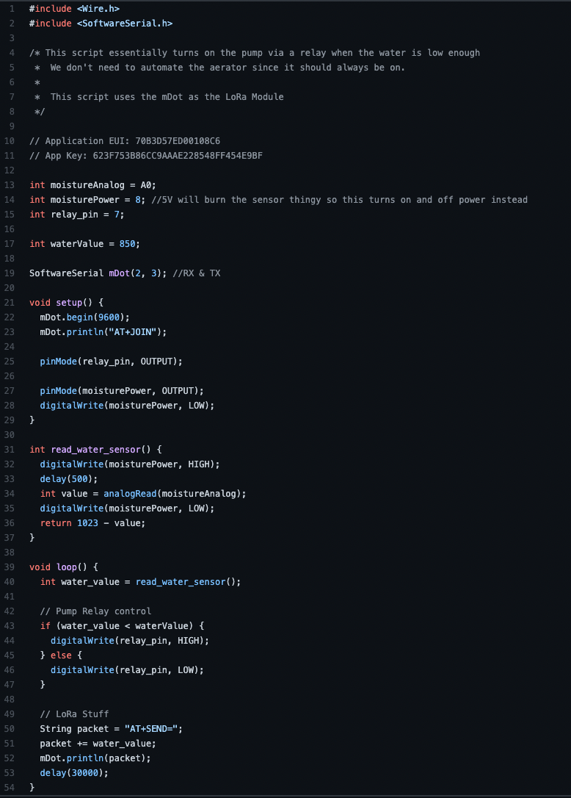
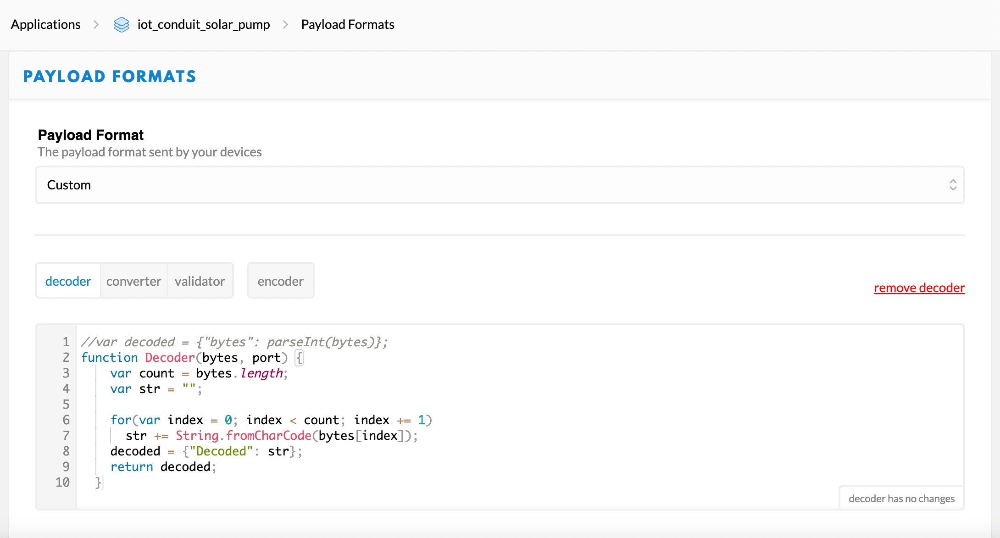

# LoRa-Solar-Pump

A soil moisture sensor turns a pump on and off with relays but thats not all! The soil moisture data is sent over LoRa to a radio and is all powered through solar!

			<h1>IoT LoRa Pump for use in Automated Greenhouses</h1>
			
This was a project I worked on that would provide the framework for an Internet of Things connected automated greenhouse. This program read data off of a soil moisture sensor and, if the water saturation was below a set static threshold, the pump connected to a water jug would turn on and water the soil. After reading the soil moisture value and acting accordingly, the Arduino board would then communicate with a LoRaWAN gateway using an mDot LoRa module. The data could then be seen on The Things Network console (Unfortunately the gateway this project used has been changed so I cannot show an example of the console data).

			

				<h3><em>Here is how the coding side of this project works</em></h3>
				
				
Here is a piece-by-piece breakdown!

				
The first part of this program is declaring the variables and telling the Arduino board which sensors are where. We initialize the moisture sensor and subsequent sensors with <code>int sensorOrRelay = pin where sensor  is connected</code>. These values are then initialized in the <code>void setup()</code>. We also initialize the mDot module and serial monitor and then send the activation instructions (<code>mDot.println("AT+JOIN");</code>) to make the mDot read instructions from the serial monitor.

				
The function <code>int read_water_sensor()</code> turns on the power to the soil moisture sensor and reads a measurement. This measurement is then used in the if/else statement in <code>void loop()</code> and tells the  Arduino whether or not it should activate the pump.

				
The last little bit of code sends the mDot module instructions and a value to send to the gateway (The value is encoded in UTF-16 to reduce message size because LoRa has incredible range but very little bandwidth). The program then waits 30 seconds before looping back to the top

			

			<h3><em>This is how the sent data (UTF-16) is decoded</em></h3>
			
			
This decoder function takes a list of UTF-16 characters as one of it's parameters. Using a for loop, the program iterates through the list using the String.fromCharCode() method which converts the UTF-16 character into an ASCII one and adds these values to a variable. The program then returns the word "Decoded: " with the variable that stored the characters attached  to the end.

			

			<table align="center">
				<caption>This table is a brief demonstration  of how data is encoded and decoded throughout my projects pipeline</caption>
				<thead>
					<tr>
						<th colspan="2">Sensor Data</th>
						<th>Output</th>
					</tr>
					<tr>
						<th>Raw</th>
						<th>UTF-16</th>
						<td></td>
					</tr>
				</thead>
				<tbody>
					<tr>
						<td>hello</td>
						<td>\u{68}\u{65}\u{6c}\u{6c}\u{6f}</td>
						<td>Decoded: hello</td>
					</tr>
					<tr>
						<td>135.56F</td>
						<td>\u{31}\u{33}\u{35}\u{2e}\u{35}\u{36}\u{46}</td>
						<td>Decoded: 135.56F</td>
					</tr>
					<tr>
						<td>(^~^)</td>
						<td>\u{28}\u{5e}\u{7e}\u{5e}\u{29}</td>
						<td>Decoded: (^~^)</td>
					</tr>
				</tbody>
			</table>
